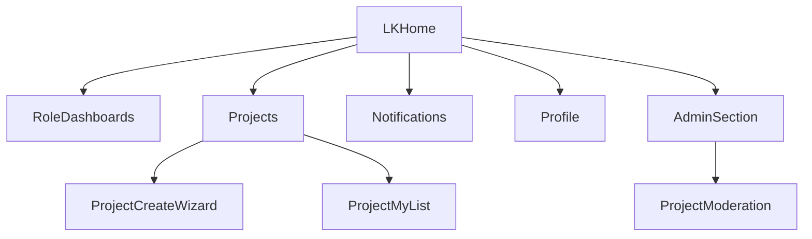

# UX/UI аудит и план внедрения (ЛК)

Дата: 2026-04-10  
Проект: `nexus-invest`  
Фокус: закрытая часть (`/lk`)

## 1) Baseline: ключевые сценарии и метрики трения

### Сценарии (as-is)
- Вход -> переход в ЛК (`/login` -> `/lk`).
- Ролевой доступ к дашбордам (investor/initiator/expert) через sidebar/topbar.
- Инициатор: `Мои проекты` -> `Новый проект` -> пошаговая форма -> `Черновик`/`Отправить на модерацию`.
- Модератор: `Модерация проектов` -> карточка проекта -> `Одобрить`/`Отклонить`.
- Пользователь: `Уведомления` -> фильтрация -> mark as read.
- Профиль: обновление данных/пароля/удаление аккаунта.

### Наблюдаемые метрики трения (по коду интерфейсов)
- **Лишние клики:** навигация до ключевых действий в среднем 3-4 клика (особенно через `Настройки` для модерации).
- **Неясные состояния:** смешение `alert` и page-level сообщений на части экранов ЛК.
- **Тупики:** встречаются неявные действия/элементы-заглушки (`#`) в смежной публичной части, влияющие на входные точки в ЛК.
- **Mobile-узкие места:** таблицы и меню действий в некоторых экранах требуют дополнительных раскрытий, не всегда явно обозначенных.

## 2) IA/навигация ЛК (аудит)

Референс-файлы:
- `resources/views/layouts/app/app.blade.php`
- `resources/views/layouts/app/topbar.blade.php`
- `resources/views/layouts/app/sidebar.blade.php`

### Что хорошо
- Роль-зависимая навигация в sidebar (скрытие недоступных разделов).
- Есть breadcrumbs на ключевых страницах.
- Уведомления вынесены в topbar + отдельный раздел.

### Проблемы IA
- Терминология частично несогласована: `Панели`, `Возможности`, `Настройки`, `Доходы`.
- Дублирование точек входа (sidebar + topbar dropdown) без явного различия назначений.
- Для части админ-сценариев путь обнаружения длиннее, чем нужно (discoverability ниже ожидаемого).

### Целевая карта IA (to-be)

## 3) Аудит ключевых экранов и матрица состояний

### 3.1 `app/pages/lk.blade.php`
- Сейчас экран минималистичен (`Вы вошли в систему!`), низкая информативность.
- Рекомендация: персонализированная панель quick actions по роли.

### 3.2 `app/pages/projects/create.blade.php`
- Сильная функциональность (stepper, draft, загрузка медиа, submit).
- Риски UX:
  - высокая когнитивная нагрузка первых двух шагов;
  - смешение системных сообщений;
  - шаг AI декларативный, без явного результата.

### 3.3 `app/pages/projects/my.blade.php`
- Хорошее empty-state и быстрый CTA `Новый проект`.
- Риск: мобильное меню действий через `⋯` может быть неочевидно без подписи.

### 3.4 `app/pages/projects-moderation/index.blade.php` и `show.blade.php`
- Базовый поток модерации реализован.
- Риск: большой объем данных в `show` без группировки по критичности (важные поля не всегда первыми).

### 3.5 `app/pages/notifications/index.blade.php`
- Хорошая фильтрация и mark-read сценарии.
- Риск: важность сообщений и read/unread в таблице не всегда быстро считываются на мобильных.

### 3.6 `app/profile/edit.blade.php`
- Все три сценария в одной точке (данные, пароль, удаление).
- Риск: удаление аккаунта внизу длинной страницы, слабый визуальный барьер между безопасными и деструктивными действиями.

### Матрица состояний (обязательная)

| Экран | loading | empty | success | warning | error | forbidden |
|---|---|---|---|---|---|---|
| LK Home | Н/Д | Н/Д | Есть (базовый текст) | Нет | Нет | Через middleware |
| Projects My | Частично | Есть | Есть (через session status) | Частично | Частично | Через роль+middleware |
| Project Create | Частично | Н/Д | Есть (draft/save) | Есть (submit guard) | Есть (validation) | Есть |
| Moderation Index | Н/Д | Есть | Косвенно | Нет | Нет | Есть |
| Moderation Show | Н/Д | Н/Д | Есть | Есть (comment needed) | Есть (validation) | Есть |
| Notifications | Н/Д | Есть | Есть | Есть (expired) | Частично | Есть |
| Profile | Н/Д | Н/Д | Есть | Частично | Есть | Есть |

## 4) A11y + mobile-first аудит

### A11y
- Проверить и унифицировать `aria-label` для иконок-действий (`⋯`, bell, menu toggles).
- Добавить более информативные `alt` для контентных изображений в ключевых карточках.
- Убедиться, что dropdown и modal полностью keyboard-доступны (tab/esc/focus return).
- Усилить видимый `focus` на интерактивах таблиц и кнопках topbar.

### Mobile
- Табличные экраны (`projects`, `moderation`, `notifications`) привести к одному mobile-паттерну действий.
- Проверить минимальный размер интерактивов (44x44).
- Убрать потенциальный горизонтальный скролл в сложных карточках/таблицах.

## 5) Приоритизированный backlog (P0/P1/P2)

### P0 (быстрые критичные улучшения)
1. Унифицировать терминологию topbar/sidebar (`Панели/Возможности/Доходы/Настройки`)  
   Файлы: `layouts/app/topbar.blade.php`, `layouts/app/sidebar.blade.php`  
   Эффект: ускорение навигации и снижение ошибок выбора.
2. Привести паттерн системных сообщений ЛК к единому виду  
   Файлы: `app/pages/projects/create.blade.php`, `app/pages/notifications/index.blade.php`, `app/profile/edit.blade.php`  
   Эффект: предсказуемость feedback.
3. Усилить mobile-actions в таблицах (явные подписи, доступность)  
   Файлы: `app/pages/projects/my.blade.php`, `app/pages/projects-moderation/index.blade.php`, `app/pages/notifications/index.blade.php`.

### P1 (структурные UX-улучшения)
1. Ролевой LK Home с quick actions вместо нейтральной заглушки  
   Файл: `app/pages/lk.blade.php`.
2. Снижение когнитивной нагрузки в wizard формы проекта  
   Файл: `app/pages/projects/create.blade.php`, `public/app/js/project-form.js`.
3. Перегруппировка блоков в moderation show по важности решения  
   Файл: `app/pages/projects-moderation/show.blade.php`.

### P2 (качество и масштабируемость UI)
1. Вынос локальных style-блоков в общие CSS-слои.
2. Унификация шаблонов пустых состояний.
3. A11y hardening: фокус, контраст, alt, aria.

## 6) Спринтовый план внедрения

### Спринт 1 (1 неделя): Quick wins
- Терминология навигации.
- Единый feedback-паттерн.
- Mobile-actions и пустые состояния.
- Smoke тесты по ключевым сценариям.

Definition of Done:
- Сокращено число неоднозначных пунктов меню.
- Во всех ключевых сценариях одинаковая логика системных сообщений.
- Mobile действия доступны и понятны без скрытых шагов.

### Спринт 2 (1-1.5 недели): Структурные улучшения
- Новый LK Home по ролям.
- Оптимизация wizard проекта.
- Реструктуризация экрана модерации.
- A11y/keyboard проход.

Definition of Done:
- Ролевые сценарии находят целевые действия быстрее.
- Форма проекта субъективно проще (меньше ошибок на шагах).
- Модерация принимает решение без поиска критичных данных по экрану.

## 7) Acceptance checklist (финальная приемка)

### Навигация
- [ ] Для каждой роли видны только релевантные разделы.
- [ ] Нет конфликтов в названиях пунктов меню.
- [ ] Все ключевые сценарии достижимы <= 3 кликов от `LKHome`.

### Формы и статусы
- [ ] Единый паттерн success/warning/error.
- [ ] Валидационные ошибки заметны и привязаны к полям.
- [ ] Шаги формы проекта показывают понятный прогресс.

### Модерация и уведомления
- [ ] Решение модератора оформляется без двусмысленностей.
- [ ] Уведомления читаются на mobile без потери контекста.
- [ ] Read/unread/expired различимы визуально и функционально.

### A11y/mobile
- [ ] Полная keyboard-навигация по критическим сценариям.
- [ ] Контраст и размеры интерактивов соответствуют минимуму.
- [ ] Нет горизонтального скролла на основных экранах ЛК.

## 8) Финальный вывод

ЛК уже имеет рабочую ролевую структуру и покрывает ключевые бизнес-потоки, но UX страдает от несогласованной терминологии, частично неоднородного feedback-паттерна и перегруженных экранов в сложных сценариях (wizard/moderation). При реализации P0+P1 можно получить заметный прирост предсказуемости интерфейса и скорости выполнения задач без изменения бизнес-логики.

